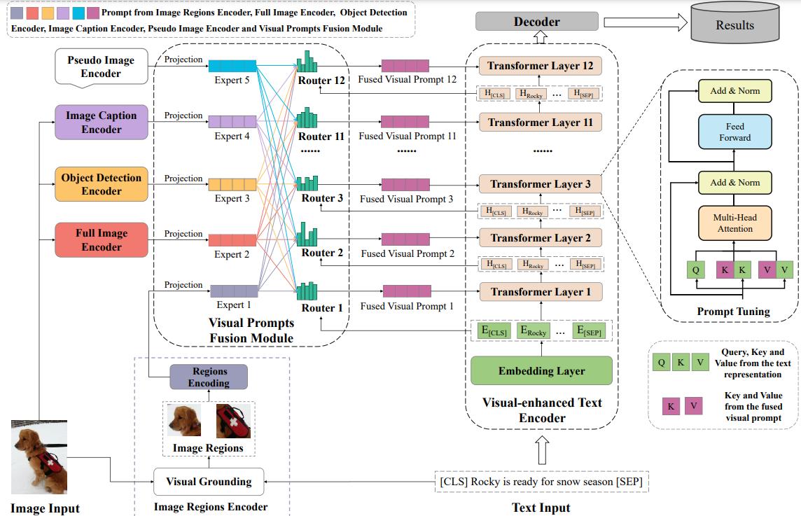

# VisualPT-MoE (Visual Prompt Tuning Framework with Mixture-of-Experts)

The pytorch implementation of "**A Unified Visual Prompt Tuning Framework with Mixture-of-Experts for Multimodal Information Extraction**" (DASFFA 2023).



# Environment

We recommend the following actions to create the environment:

```bash
conda deactivate # Leaving the current environment
conda create -n VPT python==3.7.13 # Create a new environment with python==3.7.13
conda activate VPT # Activating the environment
pip install -r requirements.txt # Install the required libraries
```

# Data Download

We use Twitter2015 and Twitter2017 on the MNER task and MNRE on the MRE task provided by [HVPNet](https://github.com/zjunlp/HVPNeT).
After you download the data, you should place it in the 'data' folder.

# Required pre-trained models

In our code, we use '../pretrained_models/bert-base-uncased' (see line-95 in run.py)  as a pre-trained model path, and you can use 'bert-base-uncased' directly or download [here](https://huggingface.co/bert-base-uncased) into your directory.

# Extraction of image features

We uploaded the extracted image features to Baidu Cloud Disk, where you can download them and put the downloaded features into 'img_ner' folder.
We provide code for extracting image features (utils/save_\*.py) to facilitate your use of different models to extract image features.

# Structure of Files

After you have prepared the required data as well as the model, your file structure should look like this:

```
VisualPT-MoE
 |-- data	# MNER text data from HVPNet
 |    |-- MNRE
 |    |-- MNRE_images
 |    |-- twitter2015
 |    |-- twitter2015_images
 |    |-- twitter2017
 |    |-- twitter2017_images


 |-- ner_img	# images features
 |    |-- caption_2015.pt
 |    |-- caption_2017.pt
 |    |-- caption_mre.pt
 |    |-- renet50_features_main_2015.pt
 |    |-- renet50_features_main_2017.pt
 |    |-- renet50_features_main_mre.pt
 |    |-- renet50_features_aux_2015.pt
 |    |-- renet50_features_aux_2017.pt
 |    |-- renet50_features_aux_mre_train.pt
 |    |-- renet50_features_aux_mre_dev.pt
 |    |-- renet50_features_aux_mre_test.pt
 |    |-- object_tags_2015.pt
 |    |-- object_tags_2017.pt
 |    |-- object_tags_mre.pt

 |-- model
 |    |-- modeling_bert.py
 |    |-- moe_model.py # our model
 |    |-- transformers # We modified the code for transformer to implement MoE

 |-- modules
 |    |-- dataset.py
 |    |-- metrics.py
 |    |-- trainer.py

 |-- weights
 |    |-- empty # Store model weights

 |-- ops # Extraction of image features
 |-- pytorch_models # Extraction of image features
 |-- utils # Extraction of image features

 |-- run.py # main (MNER)

 |-- run_mre.py # main (MRE)

 |-- ner_evaluate.py
```

# Running

After you have prepared the required data, models and image features, you can run `python run.py` to train a model in MNER, and you can run `python run_mre.py` to train a model in MRE.

